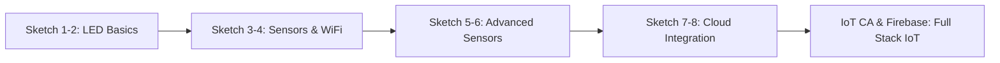

<div align="center">

# 💡 Love With IoT

### *A Comprehensive Collection of ESP8266 & NodeMCU IoT Projects*

[](https://www.arduino.cc/)
[](https://www.espressif.com/)
[](https://en.wikipedia.org/wiki/Internet_of_things)

*Exploring the fascinating world of Internet of Things with hands-on projects*

</div>

---

## 📋 Table of Contents

- [Overview](#-overview)
- [Projects](#-projects)
- [Libraries](#-libraries-included)
- [Hardware Requirements](#-hardware-requirements)
- [Getting Started](#-getting-started)
- [Project Details](#-project-details)
- [Cloud Integration](#-cloud-integration)
- [Contributors](#-contributors)

---

## 🌟 Overview

This repository contains a curated collection of IoT projects built using **ESP8266** and **NodeMCU** microcontrollers. From basic LED control to advanced cloud-integrated sensor monitoring systems, these projects demonstrate the power and versatility of IoT development.

Perfect for beginners learning IoT concepts and intermediate developers looking for reference implementations!

---

## 🚀 Projects

<table>
<tr>
<td width="50%">

### 🔴 Basic Projects
- **Sketch 1**: Internal LED Activation
- **Sketch 2**: External LED Blinking
- **Sketch 3**: Ultrasonic Sensor Distance Measurement
- **Sketch 4**: NodeMCU LED Control

</td>
<td width="50%">

### 🌡️ Sensor Projects
- **Sketch 5**: DHT11 Temperature & Humidity Sensor
- **Sketch 6**: PIR Motion Sensor
- **IoT CA**: Web Server with DHT11 Dashboard

</td>
</tr>
<tr>
<td width="50%">

### ☁️ Cloud Integration
- **Sketch 7**: ThingSpeak IoT Platform
- **Sketch 8**: Blynk App Integration

</td>
<td width="50%">

### 🔥 Firebase Projects
- **Firebase Sketch**: Real-time Database Integration

</td>
</tr>
</table>

---

## 📚 Libraries Included

This repository includes all necessary libraries for seamless project execution:

| Library | Purpose |
|---------|---------|
| 🎨 **Adafruit_NeoPixel** | RGB LED strip control |
| 🌡️ **DHT Sensor Library** | Temperature & humidity sensing |
| 🔥 **Firebase ESP8266** | Firebase real-time database |
| 📡 **PubSubClient** | MQTT protocol support |
| 🌐 **ArduinoWebsockets** | WebSocket communication |
| 📱 **Blynk** | Mobile app integration |
| 📊 **ArduinoJson** | JSON parsing & serialization |
| 🔴 **IRremoteESP8266** | Infrared remote control |
| 🎯 **MD_MAX72XX** | LED matrix display control |

---

## 🛠️ Hardware Requirements

### Essential Components
- 🔌 **ESP8266 / NodeMCU** development board
- 🌡️ **DHT11/DHT22** temperature & humidity sensor
- 📏 **HC-SR04** ultrasonic sensor
- 👁️ **PIR** motion sensor
- 💡 LEDs (various colors)
- 🔌 Resistors, breadboard, jumper wires
- 🔋 USB cable for programming

### Optional Components
- 🎨 NeoPixel LED strips
- 🔴 IR receiver/transmitter
- 📟 MAX7219 LED matrix display

---

## 🎯 Getting Started

### 1️⃣ Setup Arduino IDE

```bash
# Install Arduino IDE from: https://www.arduino.cc/en/software
```

### 2️⃣ Add ESP8266 Board Support

1. Open Arduino IDE
2. Go to **File → Preferences**
3. Add this URL to **Additional Board Manager URLs**:
   ```
   http://arduino.esp8266.com/stable/package_esp8266com_index.json
   ```
4. Go to **Tools → Board → Board Manager**
5. Search for "ESP8266" and install

### 3️⃣ Clone This Repository

```bash
git clone https://github.com/AtharvaLotankar11/Love_With_IoT.git
cd Love_With_IoT
```

### 4️⃣ Install Libraries

Copy the `libraries` folder contents to your Arduino libraries directory:
- **Windows**: `Documents/Arduino/libraries/`
- **Mac**: `~/Documents/Arduino/libraries/`
- **Linux**: `~/Arduino/libraries/`

### 5️⃣ Upload Your First Sketch

1. Open any `.ino` file from the project folders
2. Select your board: **Tools → Board → NodeMCU 1.0 (ESP-12E Module)**
3. Select the correct COM port: **Tools → Port**
4. Click **Upload** ⬆️

---

## 📖 Project Details

### 🔴 Sketch 1: Internal LED Activation
**Difficulty**: ⭐ Beginner  
**Description**: Blink the built-in LED on ESP8266  
**Learning**: Basic GPIO control, delay functions

### 💡 Sketch 2: External LED Blinking
**Difficulty**: ⭐ Beginner  
**Description**: Control external LEDs with custom patterns  
**Learning**: Digital output, circuit connections

### 📏 Sketch 3: Ultrasonic Sensor
**Difficulty**: ⭐⭐ Intermediate  
**Description**: Measure distance using HC-SR04 sensor  
**Learning**: Sensor interfacing, serial communication

### 🌐 Sketch 4: NodeMCU LED Control
**Difficulty**: ⭐⭐ Intermediate  
**Description**: WiFi-based LED control  
**Learning**: WiFi connectivity, web server basics

### 🌡️ Sketch 5: DHT Sensor
**Difficulty**: ⭐⭐ Intermediate  
**Description**: Read temperature and humidity data  
**Learning**: I2C communication, sensor libraries

### 👁️ Sketch 6: PIR Sensor
**Difficulty**: ⭐⭐ Intermediate  
**Description**: Motion detection system  
**Learning**: Interrupt handling, motion sensing

### 📊 Sketch 7: ThingSpeak Integration
**Difficulty**: ⭐⭐⭐ Advanced  
**Description**: Upload sensor data to ThingSpeak cloud  
**Learning**: HTTP requests, cloud platforms, data visualization

### 📱 Sketch 8: Blynk App
**Difficulty**: ⭐⭐⭐ Advanced  
**Description**: Control devices via Blynk mobile app  
**Learning**: Mobile app integration, real-time control

### 🌐 IoT CA Sketch: Web Dashboard
**Difficulty**: ⭐⭐⭐ Advanced  
**Description**: Beautiful web interface for sensor monitoring  
**Learning**: HTML/CSS in Arduino, web server, responsive design

### 🔥 Firebase Sketch
**Difficulty**: ⭐⭐⭐ Advanced  
**Description**: Real-time database integration with Firebase  
**Learning**: Cloud database, authentication, real-time sync

---

## ☁️ Cloud Integration

### ThingSpeak Setup
1. Create account at [ThingSpeak.com](https://thingspeak.com/)
2. Create a new channel
3. Copy your **Write API Key**
4. Update the API key in `Sketch7_ThingsSpeak.ino`

### Blynk Setup
1. Download Blynk app (iOS/Android)
2. Create new project
3. Copy your **Auth Token**
4. Update the token in `Sketch8_BlynkApp.ino`

### Firebase Setup
1. Create project at [Firebase Console](https://console.firebase.google.com/)
2. Get your database URL and secret
3. Update credentials in Firebase sketch

---

## 🎓 Learning Path



---

## 👥 Contributors

<div align="center">

**D10C - Batch B**

| Name | Role |
|------|------|
| **Atharva Lotankar** | Developer |
| **Harsh Duggar** | Developer |
| **Manaswi Kabadi** | Developer |
| **Saniya Kadam** | Developer |

</div>

---

## 📝 License

This project is open source and available for educational purposes.

---

## 🤝 Contributing

Contributions, issues, and feature requests are welcome!  
Feel free to check the issues page or submit a pull request.

---

## 📧 Contact

For questions or collaboration:
- 📧 Email: [Contact via GitHub](https://github.com/AtharvaLotankar11)
- 🐙 GitHub: [@AtharvaLotankar11](https://github.com/AtharvaLotankar11)

---

<div align="center">

### ⭐ Star this repository if you find it helpful!

**Made with ❤️ and lots of ☕**

</div>
